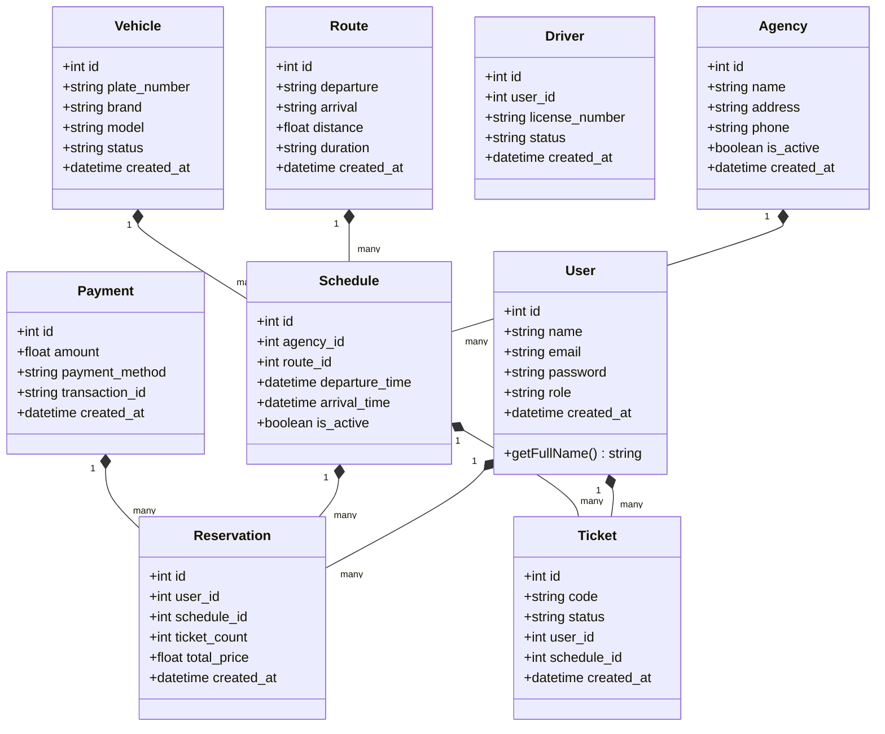

# Cahier des Charges - Système de Gestion de Transport

## 1. Vue d'ensemble du projet

Ce projet est un système complet de gestion de transport comprenant :
- **Backend** : Framework Laravel (PHP)
- **Frontend** : Application Angular 22 avec Material Design

### 1.1 Objectifs
- Gestion des agences, véhicules, conducteurs et itinéraires
- Réservation de billets et tickets
- Traitement des paiements
- Gestion des bagages et notifications
- Tableaux de bord et rapports

## 2. Modèle Conceptuel de Données (MCD)

### 2.1 Diagramme Entité-Association

```
+----------------+      +----------------+      +----------------+
|      USER      |      |    AGENCY      |      |    VEHICLE     |
+----------------+      +----------------+      +----------------+
| id (PK)        |      | id (PK)        |      | id (PK)        |
| name           |      | name           |      | plate_number   |
| email          |      | address        |      | brand          |
| password       |      | phone          |      | model          |
| role           |      | is_active      |      | status         |
| created_at     |      | created_at     |      | created_at     |
+----------------+      +----------------+      +----------------+
        |                        |                    |
        |                        |                    |
        |                        |                    |
+----------------+      +----------------+      +----------------+
|    DRIVER      |      |   SCHEDULE     |    |   TRIP/RESERVATION |
+----------------+      +----------------+      +----------------+
| id (PK)        |      | id (PK)        |      | id (PK)        |
| user_id (FK)   |      | agency_id (FK) |      | user_id (FK)   |
| license_number |      | route_id (FK)  |      | schedule_id (FK)|
| status         |      | departure_time |      | ticket_count   |
| is_active      |      | arrival_time   |      | total_price    |
+----------------+      +----------------+      +----------------+
        |                        |                    |
        |                        |                    |
+----------------+      +----------------+      +----------------+
|    ROUTE       |      |    PAYMENT     |    |     TICKET       |
+----------------+      +----------------+      +----------------+
| id (PK)        |      | id (PK)        |      | id (PK)        |
| departure      |      | amount         |      | code           |
| arrival        |      | payment_method |      | status         |
| distance       |      | transaction_id |      | user_id        |
| duration       |      | created_at     |      | schedule_id    |
+----------------+      +----------------+      +----------------+
```

### 2.2 Diagramme de Classe Principales



## 3. Flux et Fonctionnalités

### 3.1 Flux Utilisateur
1. **Authentification** : Connexion/déconnexion avec rôles (user, admin, driver)
2. **Recherche** : Recherche de trajets par route, date, agence
3. **Réservation** : Sélection de places, génération de ticket
4. **Paiement** : Traitement des paiements en ligne
5. **Gestion** : CRUD complet pour les entités (agences, véhicules, conducteurs)

### 3.2 Fonctionnalités Clés
- Gestion des agences de transport
- Catalogue de véhicules
- Planning des conducteurs et trajets
- Système de réservation en ligne
- Traitement des paiements
- Tableau de bord avec statistiques
- Export de rapports

---

## 4. Recommandations de Theme

### Theme Recommandé : **Angular Material Design**

**Raisonnement :**
- Le projet utilise déjà `@angular/material` ^22.0.4 comme dépendance principale
- Tous les composants UI sont compatibles Material Design
- Responsive design natif
- Accessibilité intégrée
- Thème par défaut professionnel et sobre

### Alternative : **Admin Template (Premium)**
- Angular Admin Dashboard templates (AdminLTE, Nebular)
- Plus de composants avancés (charts complexes, tables avancées)
- Mais nécessite une configuration supplémentaire

**Conclusion :** Angular Material est le choix le plus cohérent avec l'existant.

---

## 5. Améliorations Recommandées

### 5.1 Backend (Laravel)
- **API Documentation** : Générer la documentation automatique avec L5-Swagger ou OpenAPI
- **Tests** : Ajouter des tests unitaires et de feature pour couvrir les cas critiques
- **Authentification Renforcée** : Middleware de taux de requête (rate limiting), validation stricte des tokens
- **Optimisation des requêtes** : Eager loading sur les relations N+1 dans les contrôleurs API
- **File Upload** : Gestion sécurisée des images pour les véhicules/agences

### 5.2 Frontend (Angular)
- **Pagination** : Les scripts `add_pagination.js` et `fix_pagination.js` indiquent que la pagination n'est pas uniformément implémentée → appliquer NgxPaginationModule sur toutes les listes
- **Mode sombre (Dark Mode)** : Ajouter le support du thème sombre pour Angular Material
- **Internationalisation** : Prévoir la i18n pour les futures extensions multilingues
- **Accessibilité** : Améliorer les labels ARIA et la navigation clavier
- **Performance** : Lazy loading des pages déjà présentes, optimisation des change detection

### 5.3 Global
- **CI/CD** : Mettre en place des pipelines de déploiement automatisés
- **Docker** : Containeriser l'application (PHP-FPM + Node + Angular)
- **Monitoring** : Ajouter des logs structurés et suivi des performances
- **Sécurité** : Headers de sécurité, protection contre CSRF/XSS already partly present, but review headers

### 5.4 UML
- **Diagramme de Séquence** : Pour les flux critiques (authentification, réservation, paiement)
- **Diagramme d'ACTIVITÉ** : Pour les processus métiers complexes
- **Mise à jour du MCD** : Reflet exact de la structure actuelle des migrations

---
*Document généré le 24 septembre 2026*